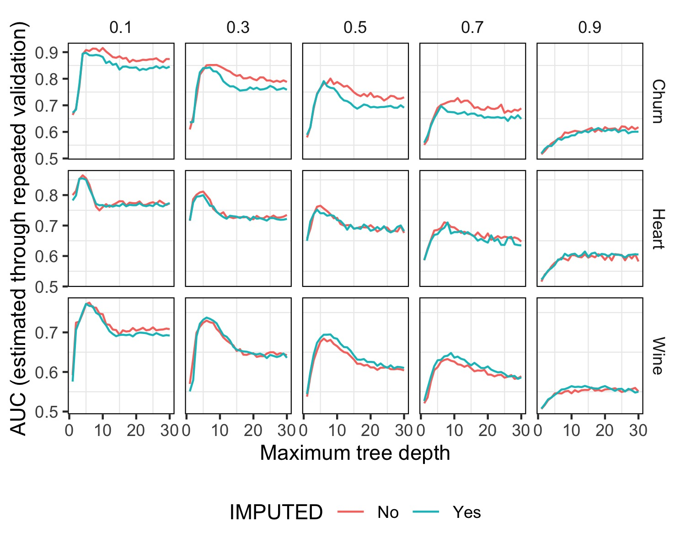

```{r}
source("exp_1.R")
```


## Experimento

El presente experimento se enfoca en analizar el impacto de distintas decisiones de modelado en el rendimiento de los modelos, el cual se estima mediante la técnica de repeated validation set.

Para llevar a cabo este experimento, se ha reproducido el proceso realizado en el experimento de ejemplo, con algunas modificaciones:

En lugar de probar únicamente valores de `prop_NAs` iguales a 0 y 0.7, se han considerado valores en el rango de 0.1 a 0.9, en intervalos de 0.2. Además de examinar los dos conjuntos de datos proporcionados, se ha incorporado en el análisis el conjunto de datos denominado $Wine Quality$, que fue elegido y preparado en la sección 1 de este trabajo práctico.


## Resultados

En el contexto de este experimento, hemos llevado a cabo pruebas utilizando diversas proporciones de valores faltantes (NA) en cada uno de nuestros conjuntos de datos. Durante este proceso, hemos realizado observaciones tanto entre diferentes conjuntos de datos como entre diversas etapas dentro de un mismo conjunto de datos.

En una primera observación, es evidente que a medida que la proporción de valores faltantes incrementa, la eficacia del modelo disminuye. Es importante destacar, además, que esta reducción del área bajo la curva se vuelve más pronunciada de manera acelerada cuando la proporción de valores faltantes supera la mitad de los datos (prop_NAs >= 0.5). Esta tendencia podría ser atribuida a que a medida que la cantidad de valores faltantes aumenta significativamente, la disponibilidad de información precisa para el proceso de modelado se ve drásticamente comprometida.


Continuando el análisis, se identifica un patrón notable en el que los conjuntos de datos logran su máximo rendimiento a profundidades menores. Sin embargo, a medida que las profundidades aumentan, el valor del AUC comienza a decrecer hasta lograr converger en un punto. 
En específico, los conjuntos de datos que presentan proporciones de valores faltantes igual o menor al 0.5 exhiben una dinámica distintiva, caracterizada por alcanzar un rendimiento óptimo y luego experimentar una caída abrupta en su desempeño. Este fenómeno puede derivar de particularidades inherentes a dichos conjuntos de datos o, posiblemente, indicar la presencia de problemas de subajuste (underfitting) y sobreajuste (overfitting).

En el caso del subajuste, un árbol con profundidad reducida presenta un nivel limitado de detalles, lo que conlleva a un modelado muy general y poco específico. Por otro lado, el sobreajuste se observa cuando un árbol con mucha profundidad captura un nivel excesivo de detalles, volviéndose extremadamente específico. Ambos escenarios resultan en un bajo rendimiento al aplicar el modelo a datos desconocidos. En este contexto, la profundidad intermedia entre ambos extremos contribuye a mejorar el rendimiento y es lo que origina la formación del "pico" en el rendimiento del modelo.

En contraste, en los conjuntos de datos con proporciones de valores faltantes superiores al 0.5, la identificación de un "pico" de rendimiento comienza a oscurecerse. Este fenómeno podría estar relacionado con la magnitud de valores faltantes, donde la cantidad tan considerable de datos no disponibles dificulta la capacidad del árbol para realizar predicciones precisas.

Vale la pena dedicar atención al escenario en que prop_NAs = 0.9. Se observa que aquí se presenta un comportamiento singular, siendo el único caso en el cual un aumento en la profundidad se asocia con un mejor rendimiento. Aunque no encontramos una hipótesis concluyente que explique este patrón, pudimos identificar que al ajustar el árbol con una profundidad considerable, se obtiene un rendimiento superior al maximizar la adaptación del modelo a los escasos datos disponibles.


Una característica que varía entre los diferentes conjuntos de datos es la separación entre las dos líneas trazadas. La línea roja indica el enfoque propio de rpart para imputar los valores faltantes, mientras que la línea azul representa la imputación de la media o moda, dependiendo de la variable, en los datos faltantes. Se observa que cada conjunto de datos parece exhibir un comportamiento distinto en este sentido. En algunos casos, la línea roja es consistentemente superior a la azul, en otros casos las dos líneas son bastante similares y, en un tercer caso, la línea azul supera a la roja.


Examinemos cada conjunto de datos de manera individual:

- **Churn**: En el caso del dataset de "customer_churn", se observa que en la mayoría de los escenarios, la línea roja supera a la azul. Este patrón sugiere que la imputación mediante la media o moda no está generando los resultados óptimos, posiblemente debido a la presencia de valores atípicos. Estos valores extremos tienden a influir negativamente en la estimación de la media.

- **Heart**: En el dataset "heart", se registra un escenario intermedio, en el cual las líneas roja y azul se mantienen muy próximas entre sí, presentando momentos en los que una supera a la otra. Estos comportamientos podrían estar relacionados con particularidades intrínsecas de los datos que interactúan con las estrategias de imputación.

- **Wine**: Por último, en el conjunto de datos "winequality", se destaca un patrón diferente en comparación con los otros conjuntos. Aquí, a medida que aumenta la proporción de valores faltantes, la línea azul comienza a superar a la roja en términos de rendimiento. Este fenómeno se debe a que este conjunto presenta menos valores atípicos y, por lo tanto, la imputación basada en la media resulta efectiva. La estrategia de r-part, por su parte, se ve más afectada por la alta proporción de valores faltantes debido a su enfoque específico, mientras que nuestra estrategia de imputación basada en la media tiende a mantenerse más cerca de la media real de los datos.

En conjunto, estas observaciones refuerzan la importancia de adaptar las estrategias de imputación según las particularidades de cada conjunto de datos. La elección de la estrategia de imputación puede tener un impacto significativo en el rendimiento del modelo, y estos análisis nos guían hacia decisiones informadas para lograr los mejores resultados posibles.





