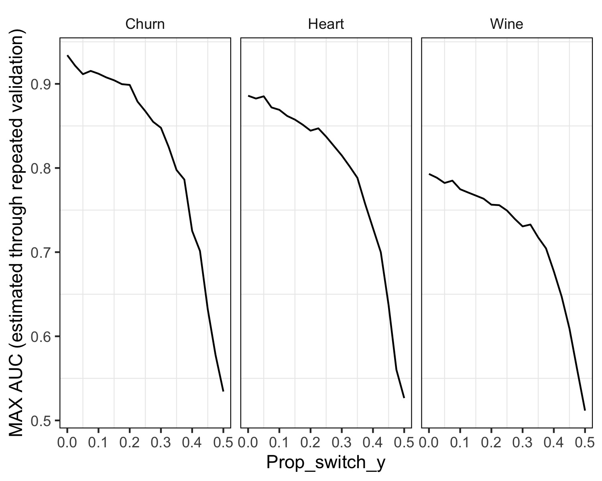

```{r}
source("exp_4.R")
```


En el presente experimento, investigamos el impacto del ruido presente en la variable objetivo en el desempeño de los árboles de decisión en nuestros conjuntos de datos. La presencia de ruido en las variables es una situación común, lo que suscita la importancia y el interés en comprender a fondo cómo los árboles reaccionan en estos escenarios.

Procedamos a realizar las observaciones detalladas:

En el análisis que estamos llevando a cabo, exploramos el efecto del ruido presente en la variable objetivo sobre el rendimiento de los árboles de decisión en nuestros conjuntos de datos.

En una primera instancia, identificamos un patrón contundente en el cual el aumento del nivel de ruido (proporción de cambio de valores en la variable objetivo, prop_switch_y) está correlacionado con una disminución en el valor máximo del Área bajo la Curva (AUC). Esta observación tiene una lógica subyacente comprensible: a medida que el ruido se incrementa, también lo hace la proporción de valores en la variable objetivo que cambian entre 0 y 1. Dado que estamos tratando con una variable de clasificación binaria, dicho cambio es esencialmente equivalente a asignar la respuesta que corresponde a "NO predicción".

Este patrón sugiere que el ruido afecta la coherencia de las respuestas predichas por el modelo. Cuanto mayor sea la fluctuación entre 0 y 1 en la variable objetivo debido al ruido, mayor será la dificultad para que el modelo capture y reproduzca con precisión los patrones genuinos en los datos. La presencia de más "intercambios" en la variable objetivo introduce incertidumbre y puede confundir al árbol de decisión, lo que resulta en una disminución del AUC.


Como resultado de la observación previamente expuesta, se manifiesta claramente un patrón coherente en los tres conjuntos de datos en estudio. Es evidente que los tres datasets alcanzan su rendimiento mínimo, representado por un MAX AUC de al rededor de 0.5, en momentos en los cuales la proporción de cambio de valores en la variable objetivo (prop_switch_y) es igual a 0.5. Este hallazgo sugiere que existe una relación entre la proporción de intercambios y la disminución drástica del MAX AUC.

Es interesante notar que, cuando la mitad de los valores en la variable objetivo experimenta el efecto del "intercambio", el MAX AUC se encuentra en su nivel más bajo, en este caso, en 0.5. Aunque la coincidencia podría parecer peculiar, posee un fundamento intuitivo sólido. Intuitivamente, el hecho de que la mitad de los valores sufra un "intercambio" implica un alto nivel de incertidumbre en las predicciones del modelo. La presencia masiva de "switches" lleva a una confusión generalizada, lo que impacta directamente en la capacidad del modelo para discernir patrones significativos.

Aunque esta particularidad podría ser específica de los tres datasets analizados, sugiere una tendencia general que puede aplicarse a situaciones más amplias. La observación señala que un equilibrio abrupto en los valores de la variable objetivo, como lo representa el prop_switch_y igual a 0.5, puede provocar una caída drástica en el rendimiento del modelo, representado por un MAX AUC de 0.5. Esta inferencia subraya la importancia de la estabilidad y consistencia en los datos objetivo, a fin de garantizar un rendimiento predictivo efectivo y confiable.


Cabe destacar que los valores iniciales del MAX AUC difieren entre los diversos datasets en análisis. Esta particularidad resulta interesante, ya que en este punto de partida, tanto la proporción de cambio de valores en la variable objetivo (prop_switch_y) como la proporción de valores faltantes (prop_NA) son iguales a 0. En consecuencia, el valor de rendimiento AUC se fundamenta en los datos originales del dataset. 

En el caso específico del conjunto de datos 'Churn', se alcanza un valor de MAX AUC que supera el 0.9 en este punto inicial. Si bien esta observación podría atribuirse a las características únicas del dataset, también es válido explorar otras variables que puedan contribuir a esta alta performance. Por ejemplo, factores como las variables predictoras podrían estar demostrando ser altamente predictivas en este escenario. Además, considerando que este conjunto de datos consta de alrededor de 3000 instancias, la abundancia de datos podría estar contribuyendo a una capacidad de predicción mejorada.

Por otro lado, en el caso del conjunto de datos 'Wine', el MAX AUC inicial parte de 0.8. Entre las razones que pueden influir en que su rendimiento no sea tan alto, se encuentra la naturaleza de sus variables predictoras y la similitud existente entre ellas. Al tratarse de variables numéricas con valores fraccionales precisos, es posible que no se presenten diferencias notables entre los valores de las diversas instancias. Esta falta de variabilidad puede impactar en la capacidad del modelo para realizar predicciones precisas y puede explicar la performance no tan alta en comparación con otros datasets.





