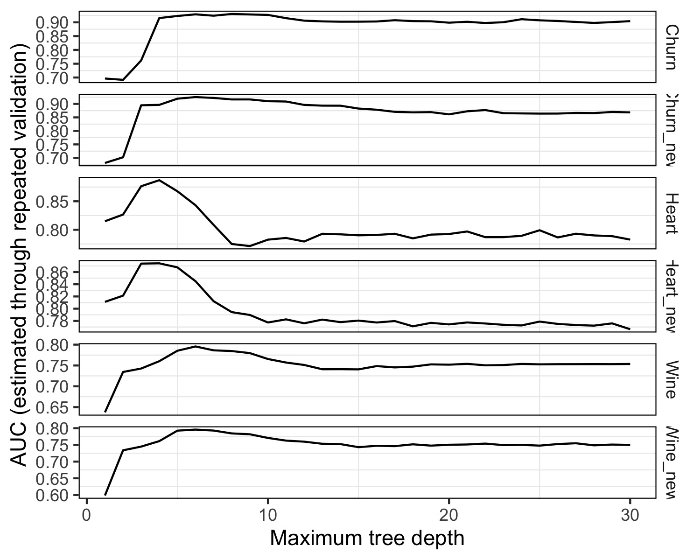

```{r, echo=FALSE, message=FALSE}
source("exp_propio.R")
```

```{r, echo=FALSE}
library(rpart)
```

## Introducción

El objetivo de nuestro experimento reside en indagar y comprender la repercusión de las variables sobre la eficacia del modelo. A través del análisis de las variables más influyentes, buscamos adentrarnos en una comprensión más profunda de cómo se toman decisiones en el contexto de cada conjunto de datos. Asimismo, examinaremos si la selección de características relevantes podría potencialmente enriquecer el desempeño del modelo.


Nuestra metodología se enfocará en la identificación de las variables más significativas basándonos en el comportamiento del modelo original y, posteriormente, seleccionando aquellas que más influyen para construir un nuevo modelo. Esta estrategia nos brindará la oportunidad de contrastar el rendimiento del nuevo modelo con el del original y analizar cualquier disparidad resultante.

## Metodología

En una fase inicial, evaluaremos la relevancia de los atributos en el modelo original mediante el uso de rpart. En este contexto, un puntaje elevado de importancia sugiere que la variable ejerce una influencia más considerable en las decisiones tomadas por el árbol, y por ende, en las predicciones resultantes.

```{r, echo=FALSE}
library(knitr)

#Buscamos las variables mas importantes de el dataset Churn
datos_churn <- read.csv("./data/customer_churn.csv")
data_df_churn <- datos_churn

tree_churn <- rpart(churn ~ ., data=data_df_churn, control=rpart.control(minsplit=2, minbucket=1, maxdepth=10, cp=0, xval=0))

variable_importance_churn <- tree_churn$variable.importance

mean_variable_importance_churn <- mean(variable_importance_churn)

kable(variable_importance_churn, caption = "Nivel de importancia de variables del dataset **Churn**", col.names = "**Importancia de Variables**", align = "c", booktabs = TRUE, longtable = FALSE )

```

```{r, echo=FALSE}

#Buscamos las variables mas importantes de el dataset Heart
datos_heart <- read.csv("./data/heart.csv")
data_df_heart <- datos_heart

tree_heart <- rpart(HeartDisease ~ ., data=data_df_heart, control=rpart.control(minsplit=2, minbucket=1, maxdepth=10, cp=0, xval=0))

variable_importance_heart <- tree_heart$variable.importance

mean_variable_importance_heart <- mean(variable_importance_heart)

kable(variable_importance_heart, caption = "Nivel de importancia de variables del dataset **Heart**", col.names = "**Importancia de Variables**", align = "c", booktabs = TRUE, longtable = FALSE )
```

```{r, echo=FALSE}

#Buscamos las variables mas importantes de el dataset Wine.
datos_wine <- read.csv("./data/winequality_modificados.csv")
data_df_wine <- datos_wine

tree_wine <- rpart(quality ~ ., data=data_df_wine, control=rpart.control(minsplit=2, minbucket=1, maxdepth=10, cp=0, xval=0))

variable_importance_wine <- tree_wine$variable.importance

mean_variable_importance_wine <- mean(variable_importance_wine)

kable(variable_importance_wine, caption = "Nivel de importancia de variables del dataset **Wine**", col.names = "**Importancia de Variables**", align = "c", booktabs = TRUE, longtable = FALSE )
```
A partir de estos valores de importancia, establecimos una estrategia para determinar qué variables serían incluidas en el nuevo conjunto de datos. Para ello, calculamos el valor promedio de importancia de todas las variables presentes en el conjunto de datos original. Posteriormente, seleccionamos aquellas variables cuya importancia superara este promedio. Como resultado, cada uno de los conjuntos de datos originales se redujo a un conjunto de seis variables predictoras de mayor relevancia.

```{r, echo=FALSE}

# Crear un data frame con los nombres de los datasets y sus respectivas importancias promedio
dataset_names <- c("ChurnRate", "HeartDisease", "WineQuality")
importancias <- c(mean_variable_importance_churn, mean_variable_importance_heart, mean_variable_importance_wine)

# Crear un data frame combinando los nombres de los datasets y las importancias
tabla_completa <- data.frame(Dataset = dataset_names, Importancia_Promedio = importancias)

# Mostrar la tabla con kable
kable(tabla_completa, caption = "Nivel de importancia promedio de variables por dataset",
      col.names = c("**Dataset**", "**Importancia promedio**"),
      align = "c",
      booktabs = TRUE,
      longtable = FALSE)

```
## Variables Importantes

Los gráficos subsiguientes ilustran las variables que exceden el valor medio, resaltadas en tono verde, y las variables que se sitúan por debajo del mismo, identificadas en color rojo. Estas representaciones visuales han sido creadas con la finalidad de discernir las variables que serán consideradas para su inclusión en los nuevos conjuntos de datos.

```{r, echo=FALSE, warning=FALSE}

# Graficamos la importancia de cada variable y el promedio
library(ggplot2)

# Crear un data frame con las variables y sus importancias
variable_importance_datac <- data.frame(
  Variable = names(tree_churn$variable.importance),
  Importance = tree_churn$variable.importance
)

# Calcular la media de las importancias
mean_importance_c <- mean(variable_importance_datac$Importance)

# Crear el scatter plot con la línea de media y puntos verdes/arriba de la media
scatter_plot_c <- ggplot(variable_importance_datac, aes(x = Variable, y = Importance)) +
  geom_point(aes(color = ifelse(Importance >= mean_importance_c, "above", "below")), size = 2) +
  geom_hline(yintercept = mean_importance_c, color = "darkgrey", size = 0.5) +
  labs(x = "Variable", y = "Importance", title = "Churn Variable Importance Scatter Plot") +
  scale_color_manual(values = c(above = "lightgreen", below = "red")) +
  theme_minimal() +
  theme(axis.text.x = element_text(angle = 45, hjust = 1),
        plot.title = element_text(hjust = 0.5),
        plot.margin = margin(0, 0,0, 0, "cm"), 
        ) +
  annotate("text", x = Inf, y = mean_importance_c, label = "Media",
           hjust = 1.2, vjust = 1.3, color = "darkgrey", size = 4) +
  guides(color = FALSE)  # Quitar la leyenda

# Mostrar el gráfico
print(scatter_plot_c, out.width = "10%")


```

```{r, echo=FALSE, warning=FALSE}
#Graficamos la importancia de cada variable y el promedio
library(ggplot2)

# Crear un data frame con las variables y sus importancias
variable_importance_datah <- data.frame(
  Variable = names(tree_heart$variable.importance),
  Importance = tree_heart$variable.importance
)

# Calcular la media de las importancias
mean_importance_h <- mean(variable_importance_datah$Importance)

# Crear el scatter plot con la línea de media y puntos verdes/arriba de la media
scatter_plot_h <- ggplot(variable_importance_datah, aes(x = Variable, y = Importance)) +
  geom_point(aes(color = ifelse(Importance >= mean_importance_h, "above", "below")), size = 2) +
  geom_hline(yintercept = mean_importance_h, color = "darkgrey", size = 0.5) +
  labs(x = "Variable", y = "Importance", title = "Heart Variable Importance Scatter Plot") +
  scale_color_manual(values = c(above = "lightgreen", below = "red")) +
  theme_minimal() +
  theme(axis.text.x = element_text(angle = 45, hjust = 1),
        plot.title = element_text(hjust = 0.5),
        plot.margin = margin(0, 0, 0, 0, "cm")
        ) +
  annotate("text", x = Inf, y = mean_importance_h, label = "Media",
           hjust = 1.2, vjust = 1.3, color = "darkgrey", size = 4) +
  guides(color = FALSE)  # Quitar la leyenda

# Mostrar el gráfico
print(scatter_plot_h, out.width = "10%")
```

```{r, echo=FALSE, warning=FALSE}
#Graficamos la importancia de cada variable y el promedio
library(ggplot2)

# Crear un data frame con las variables y sus importancias
variable_importance_dataw <- data.frame(
  Variable = names(tree_wine$variable.importance),
  Importance = tree_wine$variable.importance
)

# Calcular la media de las importancias
mean_importance_w <- mean(variable_importance_dataw$Importance)

# Crear el scatter plot con la línea de media y puntos verdes/arriba de la media
scatter_plot_w <- ggplot(variable_importance_dataw, aes(x = Variable, y = Importance)) +
  geom_point(aes(color = ifelse(Importance >= mean_importance_w, "above", "below")), size = 2) +
  geom_hline(yintercept = mean_importance_w, color = "darkgrey", size = 0.5) +
  labs(x = "Variable", y = "Importance", title = "Wine Variable Importance Scatter Plot") +
  scale_color_manual(values = c(above = "lightgreen", below = "red")) +
  theme_minimal() +
  theme(axis.text.x = element_text(angle = 45, hjust = 1),
        plot.title = element_text(hjust = 0.5),
        plot.margin = margin(0, 0, 0, 0, "cm")
        ) +
  annotate("text", x = Inf, y = mean_importance_w, label = "Media",
           hjust = 1.2, vjust = 1.3, color = "darkgrey", size = 4) +
  guides(color = FALSE)  # Quitar la leyenda

# Mostrar el gráfico
print(scatter_plot_w, out.width = "10%")
```


```{r, echo=FALSE}
#Decidimos cuantas variables dejar en cada nuevo dataset. Para eso, nos quedamos con todas las variables que superen en importancia al promedio.

top_variables_churn <- names(variable_importance_churn[variable_importance_churn > mean_variable_importance_churn])
top_variables_heart <- names(variable_importance_heart[variable_importance_heart > mean_variable_importance_heart])
top_variables_wine <- names(variable_importance_wine[variable_importance_wine > mean_variable_importance_wine])

```

```{r, echo=FALSE}
# Creamos un nuevo conjunto de datos de entrenamiento con las variables más importantes y la variable objetivo
customer_churn_top <- datos_churn[, c(top_variables_churn, "churn")]
heart_top <- datos_heart[, c(top_variables_heart, "HeartDisease")]
winequality_top <- datos_wine[, c(top_variables_wine, "quality")]

```

```{r, echo=FALSE}
#Cargamos los 3 nuevos datasets en la carpeta 'data'.

suppressWarnings({
  
ruta_archivo_nuevo <- "./data/winequality_top.csv"
write.csv(winequality_top, file=ruta_archivo_nuevo, sep = ',', row.names=FALSE)

ruta_archivo_nuevo <- "./data/customer_churn_top.csv"
write.csv(customer_churn_top, file=ruta_archivo_nuevo, sep = ',', row.names=FALSE)

ruta_archivo_nuevo <- "./data/heart_top.csv"
write.csv(heart_top, file=ruta_archivo_nuevo, sep = ',', row.names=FALSE)

})
```


### Variables de Datasets Reducidos

A raíz de lo expuesto anteriormente, hemos generado nuevos conjuntos de datos que incorporan únicamente aquellas variables que satisfacen las condiciones establecidas previamente.

```{r, echo=FALSE}
#

nuevos = data.frame(
          Churn_variables = top_variables_churn,
          Heart_variables = top_variables_heart,
          Wine_variables = top_variables_wine
          )

kable(nuevos, caption = "Variables incluidas en los nuevos datasets", col.names = c("**Churn**", "**Heart**", "**Wine**"), align = "c", booktabs = TRUE, longtable = FALSE )
```

## Resultados


Llevamos a cabo este experimento con la finalidad de indagar si incrementar el número de variables predictoras inevitablemente resulta en una mejora en el rendimiento del modelo, o si este resultado está condicionado por la importancia intrínseca de cada variable y las características particulares de los conjuntos de datos. Para efectuar este análisis, evaluamos el desempeño de los tres conjuntos de datos originales, junto con el de tres conjuntos de datos que fueron reducidos únicamente a las variables más significativas.

A grandes rasgos, podemos observar que las diferencias de rendimiento entre los conjuntos de datos originales y los conjuntos de datos reducidos son en su mayoría mínimas, siendo las performances prácticamente idénticas. Si profundizamos en los detalles, a medida que aumentamos la profundidad del árbol, se observa una ligera tendencia en la cual los conjuntos de datos originales tienen un rendimiento ligeramente superior en comparación con los conjuntos de datos reducidos.

Ahora, profundicemos en cada caso particular para determinar si este comportamiento tiene sentido en cada contexto.

### Churn

Tanto el conjunto de datos original de churn como el conjunto reducido exhiben un comportamiento sorprendentemente parecido. Las discrepancias en el rendimiento a lo largo de las profundidades del árbol son mínimas, y se observa que los picos de rendimiento se alcanzan prácticamente al mismo tiempo. Además, los valores máximos de rendimiento se sitúan en torno a 0.9, señalando un nivel de predicción bastante sólido en ambos conjuntos de datos. Además, es interesante notar que el conjunto de datos original mantiene una ligera ventaja en términos de rendimiento en todas las iteraciones de entrenamiento de los árboles.

La aparente falta de impacto en el rendimiento podría sugerir que las variables que se eliminaron no desempeñaban un papel significativo en la capacidad del modelo para anticipar las tasas de abandono. Esto podría indicar que, dentro de este contexto particular, las variables que aún permanecen son capaces de capturar de manera adecuada la información relevante para realizar predicciones sólidas acerca del churn. En el marco de la tasa de abandono (churn rate), resulta lógico que las variables que estén directamente relacionadas con los comportamientos y características de los clientes tengan un impacto sustancial en las predicciones. Las variables que mantuvieron una alta importancia se centran en aspectos como los patrones de llamadas, la frecuencia de uso y el valor del cliente. Estos factores pueden representar señales potentes acerca de si un cliente es más propenso a abandonar el servicio o a mantenerlo.

Una observación importante es que las variables eliminadas podrían haber carecido de aporte informativo único o estar altamente correlacionadas con las variables restantes. Esta correlación podría haber disminuido su valor predictivo cuando ya se consideran las otras características relevantes.

Veamos la corrrelación...


```{r, echo=FALSE}
# Cargar los paquetes necesarios
library(dplyr)

# Convertir variables categóricas a numéricas (one-hot encoding)
datos_churn <- datos_churn %>%
  mutate_if(is.character, as.factor) %>%
  mutate(across(where(is.factor), as.numeric))

# Calcular la matriz de correlación
cor_churn <- cor(datos_churn)
```

```{r, echo=FALSE}
# Cargar los paquetes necesarios
library(ggplot2)
library(reshape2) 

# Crear una función para generar un heatmap de correlación
plot_correlation_heatmap <- function(cor_matrix, title) {
  melted_cor <- melt(cor_matrix)  # Convertir la matriz de correlación en un formato de datos adecuado
  ggplot(data = melted_cor, aes(x = Var1, y = Var2, fill = value)) +
    geom_tile() +
    scale_fill_gradient2(low = "blue", high = "red", mid = "white",
                         midpoint = 0, limit = c(-1,1),
                         name = "Correlation") +
    labs(title = title) +
    theme_minimal() +
    theme(axis.text.x = element_text(angle = 45, hjust = 1),
          legend.position = "right",
          plot.title = element_text(hjust = 0.5, face = 'bold'))
}

# Crear un heatmap de correlación para cada conjunto de datos
plot_correlation_heatmap(cor_churn, "Correlation Heatmap - Churn Dataset")

```

Al analizar los valores de correlación entre las variables eliminadas y las restantes, notamos que en su mayoría son bajos. Esto sugiere que no existía una correlación fuerte entre las variables descartadas y las que se mantuvieron. Como resultado, es plausible pensar que las variables eliminadas posiblemente no añadían información distintiva que permitiera diferenciar entre las clases de predicción.

En conjunto, estos resultados sugieren que las variables más influyentes para predecir el churn están siendo capturadas por las variables que se mantienen, y que la inclusión o exclusión de las variables menos relevantes no afecta de manera significativa la capacidad del modelo para realizar predicciones precisas en este contexto particular.

### Heart 

Al observar detenidamente los gráficos de rendimiento comparativo entre el dataset original y el dataset reducido de "Heart Disease", no se evidencian diferencias significativas que merezcan ser destacadas. Las tendencias predominantes en la evolución del rendimiento son sorprendentemente similares. Los picos de rendimiento máximo, se alcanzan prácticamente con la misma profundidad. Asimismo, la evolución del rendimiento a lo largo de las diferentes profundidades es casi idéntico y ambos datasets se comportan de la misma manera. 

No obstante, es interesante resaltar que cuando se alcanza una profundidad más allá de un nivel 12, el dataset original muestra un rendimiento ligeramente superior en comparación con el dataset reducido. 

A partir de esto, podríamos inferir que la reducción del dataset no parece haber ejercido una influencia notoria ni positiva ni negativa en el rendimiento del modelo. En consecuencia, se podría concluir que las variables eliminadas no aportaban un volumen significativo de información valiosa al modelo.

A continuación, es importante examinar si este resultado tiene fundamento en el contexto de las enfermedades cardíacas. Es decir, si las variables que fueron eliminadas intuitivamente carecen de información sustancial o relevante para la detección de patrones relacionados con las enfermedades cardíacas.

Dentro del ámbito de las enfermedades cardíacas, las variables que se conservan abordan elementos cruciales como la reacción del corazón al ejercicio, la manifestación de angina inducida por el ejercicio, y características relacionadas con la edad y la sensación de dolor en el pecho. Estas variables actúan como indicadores fundamentales para evaluar la salud cardíaca y podrían desempeñar un papel esencial en la predicción de enfermedades cardíacas. Es lógico suponer que ciertas variables, como el género, posiblemente carezcan de información única suficiente para diferenciar de manera relevante entre las distintas clases de predicción.

Examinemos si las variables que fueron eliminadas podrían haber estado relacionadas con aquellas que demostraron una mayor importancia, lo que podría haber motivado su exclusión del modelo.

```{r, echo=FALSE}
# Cargar los paquetes necesarios
library(dplyr)

# Convertir variables categóricas a numéricas (one-hot encoding)
datos_heart <- datos_heart %>%
  mutate_if(is.character, as.factor) %>%
  mutate(across(where(is.factor), as.numeric))

# Calcular la matriz de correlación
cor_heart <- cor(datos_heart)

plot_correlation_heatmap(cor_heart, "Correlation Heatmap - Heart Dataset")
```
Observando la matriz de correlación entre las variables, notamos que las correlaciones entre las variables eliminadas y las variables restantes son en su mayoría bastante bajas. Esto sugiere que no había una correlación fuerte entre las variables que fueron eliminadas y las que se mantuvieron en el modelo. Es decir, estas variables eliminadas no estaban altamente correlacionadas con ninguna de las variables que se consideraron importantes.

Por lo tanto, la eliminación de estas variables no parece haber sido influenciada por la correlación directa con las variables restantes. Es posible que estas variables no aportaran suficiente información única o no fueran consideradas relevantes por otras razones, lo que podría haber llevado a su exclusión del modelo.

En resumen, parece que la eliminación de variables en el modelo de enfermedades cardíacas no estuvo fuertemente influenciada por la correlación con las variables restantes. Es probable que la selección se haya basado más en la relevancia clínica de las variables y en la capacidad de aportar información distintiva al modelo de predicción de enfermedades cardíacas.

### Wine

Al realizar un análisis de los gráficos de rendimiento del conjunto de datos de calidad de vinos, se observa que este dataset es el que parece presentar la menor influencia por la eliminación de variables. Al comparar detalladamente el rendimiento del conjunto de datos original con el conjunto de datos reducido, no se evidencia ninguna alteración significativa en su comportamiento general.

Esta estabilidad en el rendimiento podría sugerir que las variables que se eliminaron del conjunto de datos, en este caso "residual sugar" (azúcar residual) y "pH," posiblemente no desempeñaban un papel crítico en la capacidad del modelo para predecir la calidad de los vinos. A pesar de la exclusión de estas variables, el modelo mantiene una consistencia en su rendimiento al predecir la calidad de los vinos.

Una hipótesis plausible para este fenómeno es que, en el contexto de la calidad del vino, las características aportadas por las variables eliminadas podrían haber sido redundantes o estar altamente correlacionadas con otras propiedades sensoriales y químicas del vino que siguen presentes en el conjunto de datos. Por lo tanto, la eliminación de estas variables parece no afectar sustancialmente la capacidad del modelo para hacer predicciones precisas sobre la calidad del vino.

En el contexto de la calidad del vino, las variables restantes incluyen características químicas y físicas del vino. Estas variables pueden influir en la calidad percibida y real del vino. Dado que la calidad del vino se basa en componentes químicos y sensoriales, las variables seleccionadas son fundamentales para determinar cómo se percibirá el vino en términos de calidad.

Es importante analizar si las variables que se eliminaron del conjunto de datos de calidad de vinos podrían haber estado relacionadas con aquellas que se mantuvieron en el modelo. Para hacerlo, observemos el mapa de calor que muestra la correlación entre las variables.


```{r, echo=FALSE}
# Cargar los paquetes necesarios
library(dplyr)

# Calcular la matriz de correlación
cor_wine <- cor(datos_wine)

plot_correlation_heatmap(cor_wine, "Correlation Heatmap - Wine Dataset")
```

En este caso, no se observan correlaciones particularmente altas o evidentes entre las variables eliminadas y las que se mantuvieron. Por ejemplo, las variables "fixed.acidity," "chlorides," y "pH" presentan correlaciones con las variables restantes que son bastante bajas, lo que sugiere que no hay una fuerte relación lineal entre estas variables.

Dado que las correlaciones no muestran una conexión clara entre las variables eliminadas y las variables que se mantuvieron en el modelo, es posible que las variables eliminadas no hayan sido excluidas debido a una correlación directa con las variables restantes. En cambio, otras consideraciones, como redundancia de información, relevancia contextual o impacto en la capacidad predictiva, parecen haber influido en su eliminación.